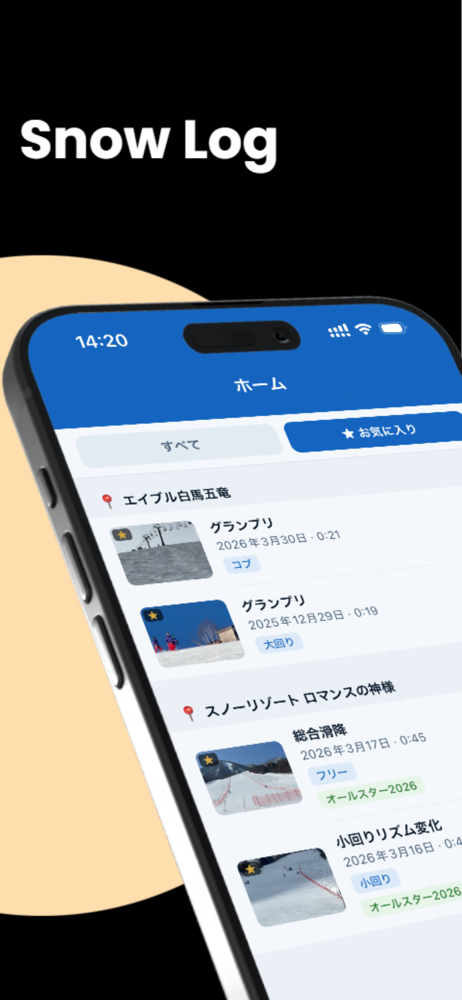
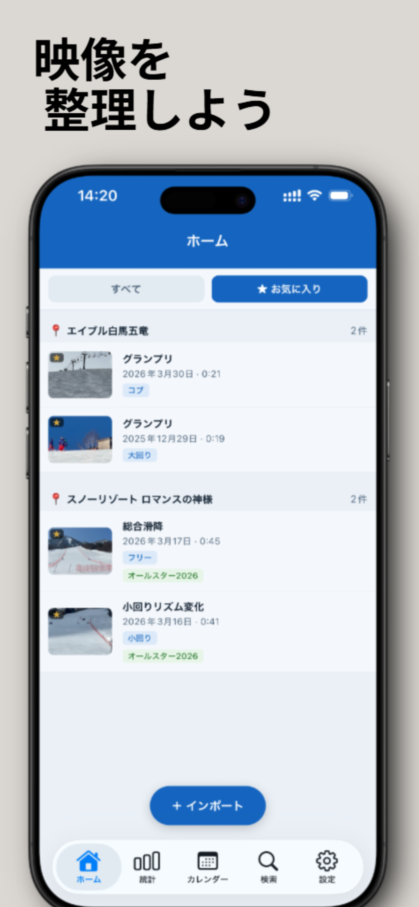
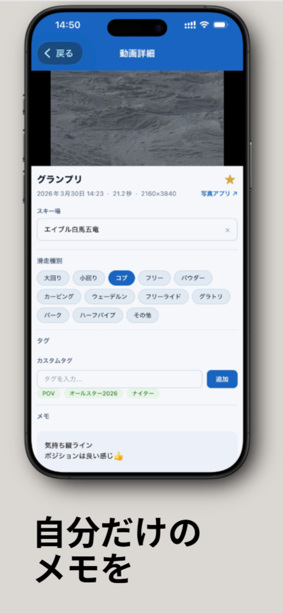
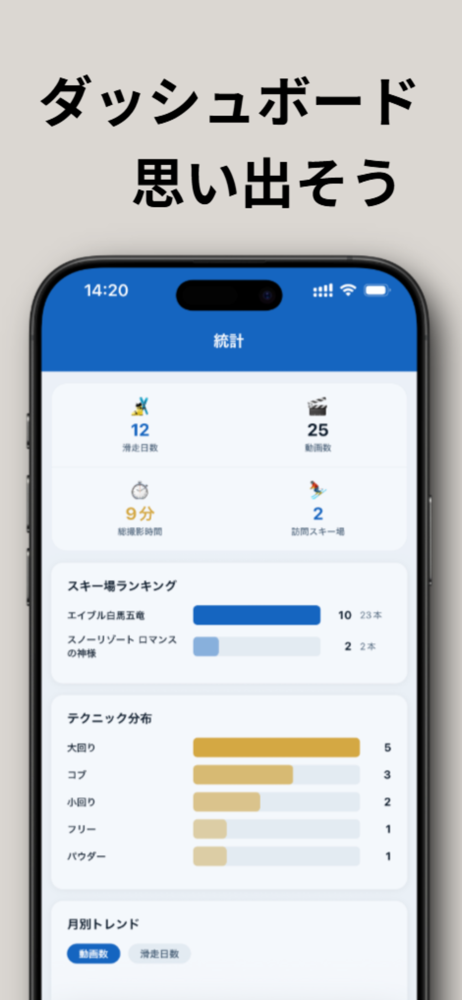
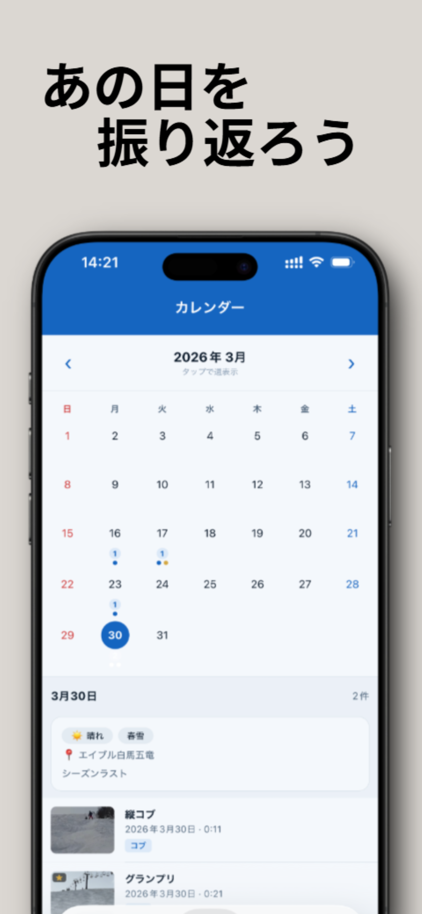

<p align="center">
    
</p>

# SnowLog

スキー・スノーボードの滑走動画を、ゲレンデと技術単位で整理し、気持ちよく振り返るためのオフラインファースト iOS アプリである。


---

## アプリの画面

<p align="center">
    
    
    
</p>

<p align="center">
    
    
</p>

---

## 開発の背景

本アプリの出発点は、開発者自身が抱える二つの不便であった。

### 1. 滑走動画が写真アプリに埋もれる

iPhone で撮影したスキー・スノーボードの滑走動画は、写真アプリ上では撮影日付の軸でしか探せない。シーズン単位・ゲレンデ単位・技術単位で振り返ろうとすると、膨大なスクロールと記憶頼りの探索を強いられる。「あの日あのゲレンデで撮ったターンの一本」を見返したいだけなのに、実際には辿り着けないまま忘れ去られる動画が積み上がっていた。

### 2. 自分の滑りを整理された形で記録したい

開発者は大学のサークルで基礎スキーに取り組んでおり、フォームや技術単位での映像比較は上達に直結する。しかし市販の手段では、滑走映像を技術ラベル付きで時系列に並べ、ゲレンデや雪質・天候と紐づけて残すような整理手段が存在しなかった。

### 市場調査の結果

開発前に国内外のアプリを調査したが、**スキー／スノーボードの滑走記録に特化したアプリは国内外いずれにも存在しなかった**。海外のアプリは主にリフト券管理・レンタル予約・コース案内に寄っており、日本語 UI と日本のゲレンデデータを備えた整理ツールは皆無である。この空白を埋めるのが SnowLog の位置付けである。

### スコープの定義

以上を踏まえ、本アプリは以下のスコープで設計した。

- **オフラインファースト**: クラウド同期を前提としない。ゲレンデは電波が届かない場所も多く、端末単体で完結することを最優先とする。
- **日本のゲレンデデータを内蔵**: 全国 378 のゲレンデ座標を同梱し、GPS から自動判定する。
- **参照型ストレージ**: 大容量の動画ファイルを複製せず、OS の写真ライブラリへの参照として扱う。

**開発期間**: 2026 年 2 月開始、継続改善中。**App Store 初公開日**: 2026/04/09。

---

## 主な機能

- **滑走動画の取り込み** — `expo-media-library` / `expo-image-picker` 経由で単体・一括（最大 20 件）対応。iCloud 上のアセットは `shouldDownloadFromNetwork` によりオンデマンドで取得する。
- **EXIF / GPS 自動抽出** — 撮影日時と GPS 座標を抽出し、内蔵する 378 ゲレンデ座標とマッチングしてゲレンデ名を自動判定する。
- **多軸での整理** — カスタム技術マスタ（ドラッグ＆ドロップ並び替え可）、タグ（多対多）、お気に入りゲレンデによる分類を提供する。
- **全文検索 + 複合フィルタ** — ファイル名・タイトル・メモの LIKE 検索に、タグ／お気に入り／日付プリセットの絞り込みを重ねられる。
- **カレンダー（月 / 週ビュー）＋ 日記** — 日単位で動画数と日記の有無を可視化し、天候・雪質・同行者・疲労度・経費・滑走本数を `DiaryEntry` として記録する。
- **ダッシュボード統計** — シーズン別サマリ、ゲレンデランキング、技術構成比、月次トレンド、アクティビティヒートマップを表示する。
- **動画重複検出** — 撮影日時・長さ・ファイル名類似度を重み付きでスコアリングし、高信頼度／中信頼度の 2 段階で候補グループ化する。
- **一括操作 / データエクスポート** — 長押し選択モードによる一括削除、および全データの JSON エクスポート（`expo-sharing` 経由）を備える。

---

## 技術スタック

| 技術 | 役割 | 採用理由 |
| --- | --- | --- |
| [Expo SDK 55](https://docs.expo.dev/) / [React Native 0.83.4](https://reactnative.dev/) / [React 19.2](https://react.dev/) | UI フレームワーク | React Compiler を有効化でき、iOS 26 の最新機能（Liquid Glass など）への追従が早いため |
| [Expo Router v4 (NativeTabs)](https://docs.expo.dev/router/introduction/) | ルーティング | `typedRoutes: true` による型安全なルーティングと、iOS 26 の NativeTabs／Liquid Glass タブバーへの追従のため |
| [expo-sqlite](https://docs.expo.dev/versions/latest/sdk/sqlite/) v15 + [Drizzle ORM](https://orm.drizzle.team/) | ローカル DB | 完全オフライン動作を前提に、スキーマ定義・型推論・マイグレーション運用を単一のソースで管理するため |
| [expo-media-library](https://docs.expo.dev/versions/latest/sdk/media-library/) / [expo-image-picker](https://docs.expo.dev/versions/latest/sdk/imagepicker/) / [expo-video](https://docs.expo.dev/versions/latest/sdk/video/) / [expo-video-thumbnails](https://docs.expo.dev/versions/latest/sdk/video-thumbnails/) | 動画 I/O | 動画の取り込み・サムネイル生成・再生を Expo エコシステム内で統一するため |
| [expo-file-system/legacy](https://docs.expo.dev/versions/latest/sdk/filesystem/) | ファイル操作 | 新 API は動画共有用途で未成熟だったため、安定している legacy API を明示的に選択 |
| [react-native-gesture-handler](https://docs.swmansion.com/react-native-gesture-handler/) 2.30 + [Reanimated](https://docs.swmansion.com/react-native-reanimated/) 4.2 | ジェスチャ／アニメーション | 長押し選択・滑らかなリストインタラクションのため |
| [react-native-draggable-flatlist](https://github.com/computerjazz/react-native-draggable-flatlist) | 並び替え UI | 技術マスタのドラッグ＆ドロップ並び替えのため |
| [EAS Dev Build](https://docs.expo.dev/develop/development-builds/introduction/) | ビルド基盤 | SDK 55 は Expo Go 非対応のため、Dev Client ベースで開発する必要があるため |

---

## アーキテクチャ

### レイヤー構成

上位層から DB までを単方向に積み上げ、各層の責務を分離している。

```
UI (src/app, src/components)
  ↓
Hooks (useVideos / useVideoDetail / useDashboard / useCalendarEnhanced / useDiaryEntry / useSelectionMode)
  ↓
Services (importService / thumbnailService / duplicateDetectionService / exportService / videoDeletionService)
  ↓
Repositories (videoRepo / tagRepo / diaryEntryRepo / dashboardRepo / favoriteResortRepo / techniqueOptionRepo / appPreferenceRepo)
  ↓
Database (expo-sqlite + Drizzle ORM)
```

### 主要データフロー（動画取り込み）

```
video-import.tsx
  → importService (EXIF/GPS 抽出・重複除外)
  → mediaService.getAssetInfo (iCloud ダウンロード含む)
  → thumbnailService (サムネイル生成)
  → geoUtils (GPS → ゲレンデ判定)
  → videoRepository (SQLite へ永続化)
```

### プラットフォーム分離戦略

iOS を主ターゲットとしつつ、Web では検証のためのスタブを維持している。ネイティブ依存モジュールは `.web.tsx` シムで代替する二重配置戦略（Repositories / Services / Hooks / Video 画面）を採っており、片方の更新が他方を壊さないようインターフェース層で切り離している。

---

## データモデル

主要テーブルは以下の 7 つである（`src/database/schema.ts`）。

| テーブル | 主要列 | 関連 |
| --- | --- | --- |
| `videos` | id, assetId, filename, thumbnailUri, duration, capturedAt, skiResortName, memo, title, techniques(JSON), isFileAvailable, isFavorite | `video_tags` を介して `tags` と多対多 |
| `tags` | id, name, type (`technique` / `skier` / `custom`) | `video_tags` 経由 |
| `video_tags` | videoId, tagId | pivot |
| `technique_options` | id, name, sortOrder | 技術マスタ（ユーザー編集可） |
| `favorite_resorts` | id, name (unique) | お気に入りゲレンデ |
| `diary_entries` | id, dateKey (YYYY-MM-DD, unique), skiResortName, weather, snowCondition, impressions, temperature, companions, fatigueLevel, expenses, numberOfRuns | 1 日 1 エントリ |
| `app_preferences` | key, value | カレンダーモード等の設定 K/V ストア |

マイグレーションは Drizzle Kit で自動生成し、起動時に `useMigrations` で適用している。

---

## 技術的な意思決定と苦労したこと

### 1. オフラインファースト × 参照型ストレージの設計判断

滑走動画は 1 本あたり 50〜500MB に達する大容量ファイルで、端末の写真ライブラリに既に存在している。これをクラウド同期したり、アプリ内にコピーしたりすれば、通信コストと端末ストレージ消費が即座に限界を超える。

この制約を踏まえ、**クラウド同期を導入せず、`expo-sqlite` + Drizzle ORM によるローカル完結構成とし、動画本体は移動・複製せず `assetId` で参照のみ持つ** 設計に振り切った。サムネイルと「管理コピー」のみを `documentDirectory` に配置する。

ただし参照型には副作用があり、次の点で苦労した。

- **iCloud 未ダウンロードアセット**への対応が必要だった。取り込み時に `shouldDownloadFromNetwork` を指定してオンデマンド取得させ、UI 側では進捗を表示する導線を追加した。
- **ユーザーが写真アプリ側で元動画を削除した場合**、参照切れが発生する。これを検出するため `isFileAvailable` フラグを導入し、`updateFileAvailability` による健全性チェックを通じて、参照切れ動画が表示されてもアプリ全体がクラッシュしない導線を `useVideoDetail` 側で徹底した。

結果として、ネットワーク不要・初期同期ゼロで即起動でき、大容量動画でも端末ストレージを二重消費しないアプリとして成立している。

### 2. EXIF / GPS からのゲレンデ自動判定と、動画の重複検出

ユーザーに毎回ゲレンデ名を手入力させるのは UX が致命的に悪い。また、過去動画をまとめて取り込むと重複動画の山が発生することも避けられない。この二点を同時に解く必要があった。

**ゲレンデ判定**では、`src/constants/skiResorts.json` に日本全国の 378 ゲレンデの座標データを内蔵し、動画の EXIF から取得した GPS 座標と **Haversine 距離による最近傍マッチング** で候補を提示する方式を採った。単一候補に絞れる場合は自動適用し、複数候補が競合する場合は `GpsConfirmationDialog` でユーザーに確認させるハイブリッド UX とした。

**重複検出**では、`duplicateDetectionService.ts` で撮影日時差・動画長差・ファイル名類似度を重み付きでスコアリングし、**高信頼度（`high`）／中信頼度（`medium`）** の 2 段階で分類する設計にした。

これらで苦労した点は次の通りである。

- GPS 座標が欠損した動画（屋内撮影、古い機種、プライバシー設定により除去されたもの）に対するフォールバック導線の整備。
- 日本のスキーエリアは隣接ゲレンデが密集する（例: 白馬エリア）ため、単純な最近傍では誤判定が発生する。距離閾値と候補リストの両方を UI 側で扱えるよう API を設計し直した。
- 重複検出は「誤検出で動画を消してしまう」リスクが極めて大きい。そのため自動削除は行わず、**候補提示 + 明示的な一括アクション** に分離し、設定画面 `settings/duplicate-candidates.tsx` を独立させて安全側に倒した。

結果として、取り込み時のゲレンデ入力はほぼ自動化され、重複候補は設定画面から安全にクリーンアップできる。

### 3. 初モバイル開発での UI 設計試行錯誤

本プロジェクトは開発者にとって初のモバイルアプリ開発であり、Web とは異なる設計原則（タブナビゲーション、ジェスチャ主体の操作、セーフエリア、ハプティクス）のすべてが初体験であった。結果として、ナビゲーションバーからホーム画面まで、**アプリ全体の UI が試行錯誤の対象**となった。

試行錯誤した主な領域は次の通りである。

- **ナビゲーション構成**: 「ホーム / ダッシュボード / カレンダー / 検索 / 設定」の 5 タブに定着するまでに、ホーム単一画面から機能を分離する過程で数度組み換えた。最終的には Expo Router v4 の `NativeTabs` + Liquid Glass タブバーに移行した。
- **ホーム画面の情報密度**: 「動画一覧 + お気に入り」をセグメント切替で一画面にまとめるか、別画面に分離するかを検討した末、`SectionList` によるゲレンデ別グルーピング + セグメント切替に収束した。
- **一括操作の導線**: 長押し選択モードへの遷移、`BulkActionToolbar` による操作集約、選択解除のジェスチャを `useSelectionMode` フックに抽象化した。
- **横スワイプによるタブ切替**: 一度導入したが、動画カード側のジェスチャと干渉したため撤回した（commit `a79b563`）。やってみて外す判断も設計の一部である。

この過程で得た最大の学びは、**Web で通用した「ボタンを並べれば伝わる」設計はモバイルでは密度過剰になる** という点である。ジェスチャと FAB、長押し選択、画面階層の分割を優先する方向に頭を切り替える必要があった。加えて、iOS 26 の Liquid Glass 効果を活かしつつコントラスト低下による可読性低下を起こさない調整にも神経を使った。

結果として、ネイティブ流儀（タブ + ジェスチャ + FAB + 長押し選択）に沿った UI に収束している。段階的な撤回と収束の履歴はコミット単位で残っており、判断の試行錯誤そのものがポートフォリオとしての成果でもある。

---

## 今後の改善予定

- **ダッシュボードの拡張と最適化** — 大量動画時のクエリ高速化、可視化レイアウトの追加。
- **多機能化** — 実利用フィードバックに基づく細部機能の拡張。
- **SkiSense との連携（検討中）** — 開発者による姉妹プロジェクト [kmch4n/SkiSense](https://github.com/kmch4n/SkiSense)（コンピュータビジョンによる滑走姿勢評価ツール）の解析結果を SnowLog のログに紐づける構想。現時点では構想段階にある。

---

## License

**All Rights Reserved.** Copyright (c) 2026 kmch4n.

著作権は開発者に帰属し、本ソースコードのいかなる利用・複製・改変・再配布・商用利用・アプリケーションストアへの公開も許諾しない。

"SnowLog" の名称、アプリアイコン、スクリーンショット、UI デザイン、およびブランドに関する一切の権利は開発者に帰属する。派生アプリ等での本名称・ロゴ・類似のブランド要素の使用は、いかなる場合も認めない。

詳細は [LICENSE](LICENSE) を参照。
