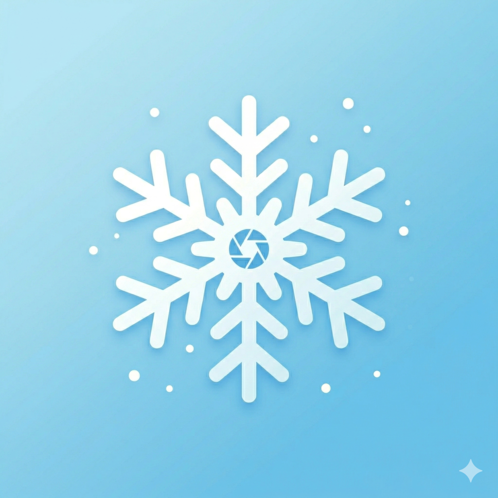
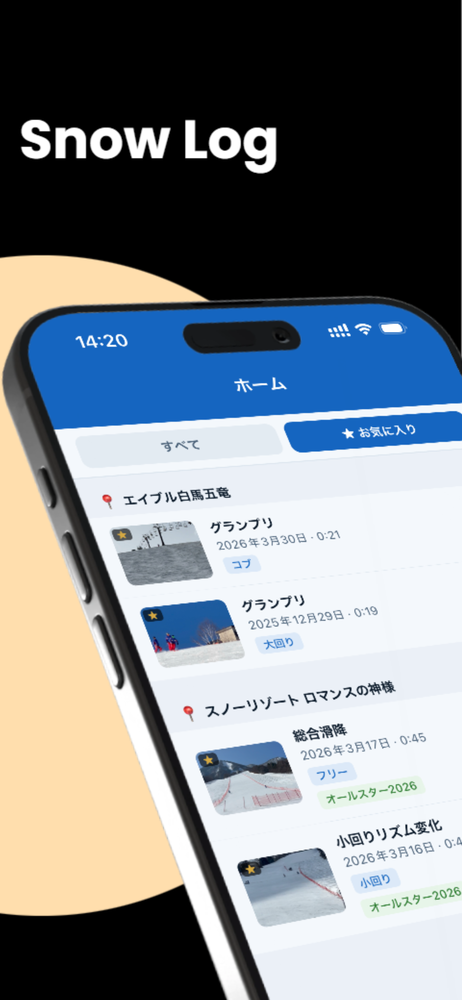
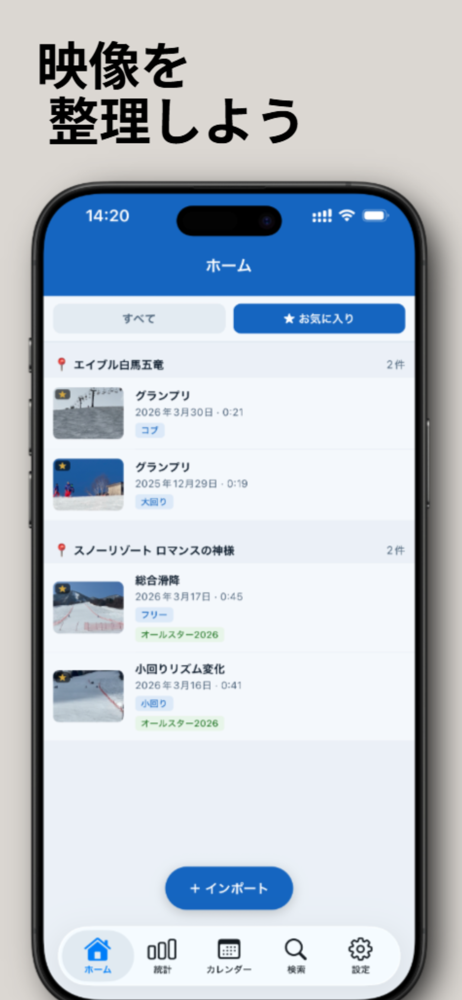
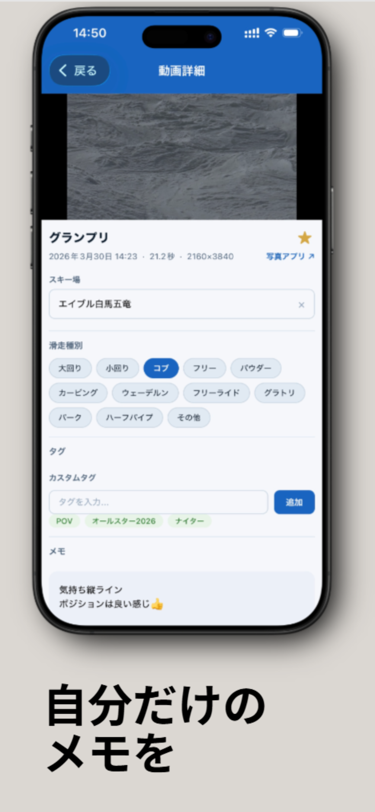
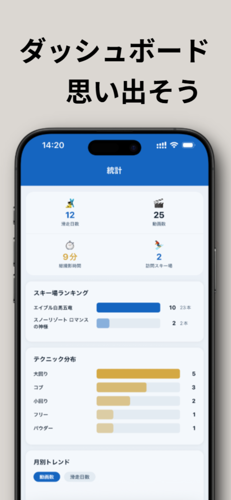
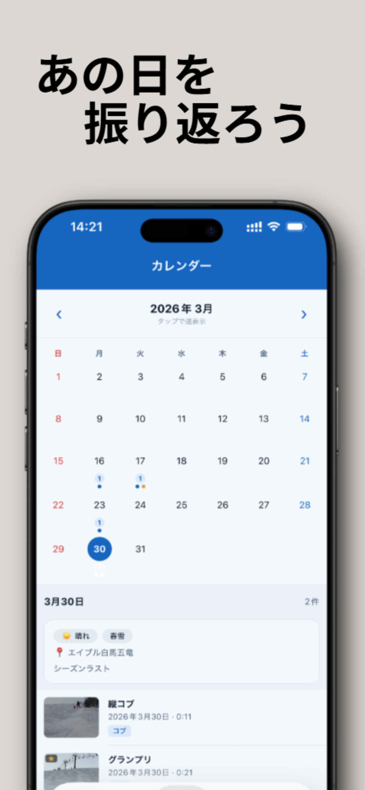

    

<h1 align="center">SnowLog</h1>

    滑走動画を、練習ログへ。 
    スキー・スノーボードの動画をゲレンデと技術で整理して振り返る、iOS アプリです。

    
    
    
    

---

## 紹介映像

https://github.com/user-attachments/assets/cfae5ed5-ee5b-4d0c-9b47-ee4a3946c094

1 分 42 秒で、SnowLog でできることをひととおりご覧いただけます。

---

## こんなこと、ありませんか

**撮った滑りが、写真アプリの中で行方不明になる。**

写真アプリで動画を探せる軸は、撮影日だけです。「去年の白馬で撮った小回りの一本」を見たいだけなのに、
延々とスクロールして、結局見つからないまま忘れていく。滑走動画は 1 本で数百 MB あるので、
気軽に整理用のフォルダへコピーすることもできません。

**上達したいのに、比べる手段がない。**

フォームの改善は、過去の自分と見比べるのが一番早い。でも「大回り」「コブ」といった技術ごとに
並べて見返せる場所が、どこにもありませんでした。

SnowLog は、この 2 つを解決するために作りました。

---

## SnowLog がすること

### 📍 ゲレンデごとに、勝手にまとまる

動画に埋まっている GPS から、全国 **378 ゲレンデ**のデータと照らして滑った場所を自動で判定します。
ゲレンデ名を手で入力する必要はありません。近くのゲレンデが競合するときだけ確認を挟みます。

### 🎿 技術やタグで引ける

大回り、小回り、コブ — 練習した内容を動画に紐づけて残せます。技術の項目は自由に追加・並べ替えできるので、
ご自身の練習メニューに合わせられます。タグや滑走者名でも絞り込めます。

### 📅 カレンダーと日記で、その日ごと振り返る

滑った日がカレンダー上に色で浮かびます。天候、雪質、気温、同行者、滑走本数、経費、そして感想 —
その日のことを日記として残せば、動画とセットで見返せます。

### 📊 シーズンを通した振り返り

滑走日数、動画本数、よく行ったゲレンデのランキング、練習した技術の構成比、月ごとの推移。
シーズンが終わったときに、自分が何をどれだけやったのかが数字で見えます。

### 📥 まとめて取り込める

シーズン中に溜まった動画を、一度に最大 20 本まで取り込めます。iCloud にしか残っていない動画も、
必要なぶんだけ自動で取り寄せます。似た動画が重なったときは候補として提示するので、
まとめて安全に片付けられます。

### ✈️ 電波がなくても動く

ゲレンデは電波が届かない場所が多い。だから SnowLog はクラウド同期を前提にしていません。
起動に通信は不要で、初回の同期待ちもありません。

---

## アプリの画面

    
    
    

    
    

---

## 大事にしていること

**動画は、増やしても重くならないように。**

SnowLog は動画本体をアプリの中へコピーしません。写真ライブラリにあるものを参照するだけです。
整理のために同じ動画を二重に持たないので、撮った本数が増えても端末のストレージを圧迫しません。

**データは、端末の外に出さない。**

メモ、タグ、位置情報、日記 — 入力したものはすべて端末内で完結します。サーバー同期はありません。
アナリティクスや広告の SDK も入れていません。外部との通信は、新しいバージョンが出ているかを
App Store に問い合わせる 1 本だけで、そこに利用者のデータは含みません。

**日本のゲレンデで、ちゃんと使えるように。**

日本全国 378 ゲレンデの座標を内蔵しています。海外のスキーアプリはリフト券管理やコース案内が中心で、
日本語で滑走記録を整理できるものが見当たらなかったので、そこを埋めるものとして作りました。

---

## ダウンロード

**[App Store で無料で入手](https://apps.apple.com/jp/app/snowlog-snow-video-review-app/id6761445679)** — iOS 16 以上。
アプリ内課金も広告もありません。

ウェブサイト: [snowlog.kmchan.jp](https://snowlog.kmchan.jp)

### いまはできないこと

正直にお伝えしておきます。

- **機種変更時のデータ移行** — 現在、端末間でデータを引き継ぐ機能はありません。実装予定ですが時期は未定です（[#72](https://github.com/kmch4n/SnowLog/issues/72)）。
- **Android 版** — iOS のみの提供です。iOS で十分に育った段階で検討します。

---

## これから

- **ダッシュボードの拡張** — 動画が増えたときのクエリ高速化と、可視化の追加。
- **データ移行手段の実装** — 上記のとおり、機種変更に対応したい。
- **[SkiSense](https://github.com/kmch4n/SkiSense) との連携（構想中）** — 姉妹プロジェクトであるコンピュータビジョンによる滑走姿勢評価ツールの解析結果を、SnowLog のログに紐づけたい。

---

## 開発について

開発者は大学のサークルで基礎スキーに取り組んでおり、このアプリは自分自身が欲しかったものです。
2025 年 12 月に開発を開始し、2026 年 1 月に App Store で初公開、以降も改善を続けています。
初めてのモバイルアプリ開発でもありました。

技術的な内容は用途別に分けています。

| 知りたいこと | 資料 |
| --- | --- |
| 技術選定の理由、設計判断とその経緯、苦労したこと | [設計ノート](docs/design-notes.md) |
| 現在の実装仕様（データモデル、画面フロー、責務分担） | [技術仕様書](SnowLog.md) |
| 開発規約・コマンド・テスト | [`.codex/AGENTS.md`](.codex/AGENTS.md) |

紹介映像は [Remotion](https://www.remotion.dev/) 製で、ソースは `pr/pv/` にあります。
ランディングページは Astro 製で `pr/web/` です。

---

## License

**All Rights Reserved.** Copyright (c) 2026 Kotaro Sasagawa.

著作権は開発者に帰属し、本ソースコードのいかなる利用・複製・改変・再配布・商用利用・アプリケーションストアへの公開も許諾しない。

"SnowLog" の名称、アプリアイコン、スクリーンショット、UI デザイン、およびブランドに関する一切の権利は開発者に帰属する。派生アプリ等での本名称・ロゴ・類似のブランド要素の使用は、いかなる場合も認めない。
